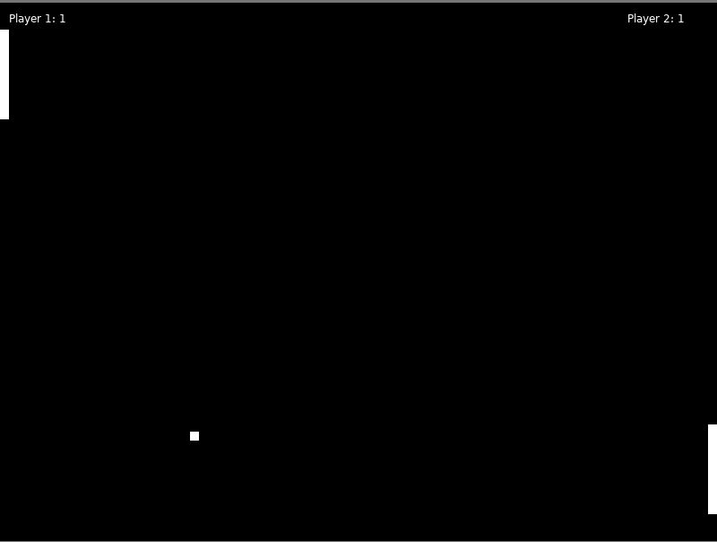

# Pong Game in LÖVE 2D

This is a basic implementation of the classic Pong game using the [LÖVE 2D game framework](https://love2d.org/). The game features two paddles and a ball that bounces around the screen. Players can control the paddles using keyboard inputs to prevent the ball from going out of bounds.

## Controls

- **Player 1:**
  - `W` key to move the paddle up.
  - `S` key to move the paddle down.
- **Player 2:**
  - `Up Arrow` key to move the paddle up.
  - `Down Arrow` key to move the paddle down.
- Press `ESC` to quit the game.

  ## How to run
  - make sure you installed Love2D
  - download the repo
  - open the main.lua file with an editor
  - run the file

  
